# Homework 4: 重返秘境

姓名：宋源祎 $\quad$ 学号：522030910158

##  Code Implementation and Evaluation Result

### 算法实现

DQN的更新函数为：
$$y=r+\gamma\max_{a'} Q(s',a')$$
算法实现中只需要完成三个部分：
1. 针对Target DQN和Double DQN(Dueling DQN)增加目标网络初始化。
2. 针对三种算法实现，计算对应的 $\max_{a'} Q(s',a')$
3. 实现训练时的损失计算并更新目标网络
具体实现请见提交的 agent.py，里面有详细的注释。

### 网络修改
在修改Model时，因为给定的agent代码是 from dqn.model.model import Model，所以我分别根据两个model都进行了变成QA网络的修改，最终提交的结果是./dqn/model/model.py的变体。两个文件的网络结构在卷积层数、隐层维度等方面都有区别。经实验验证，./dqn/model/model.py中的网络训练速度快（将近三倍）且效果好（收敛时间快、更稳定、奖励值更高），分析是由于./target_dqn中的网络较为简单，卷积层数更少且CNN输出维度（中间隐层维度）更大（128 vs 4096），特征提取不够充分。

最终提交的model文件中网络结构描述如下：输入数据先经过4个卷积块，然后经过flatten和一个线性层将特征进一步提取到128，将该处理过的128维的特征与原始向量特征进行拼接，然后再经过多个线性层用来从图像特征（observation feature）计算出最终的价值。如果是 dueling qdn，则需要两个网络A和V，若不考虑batch，A网络输出维度为action_space，V网络输出维度为1，在前向计算中分别计算后，再将两个输出值计算得到该状态的Q；若不是dueling dqn，则只需要一个网络，经过三层线性层后直接得到Q值。另外根据网络输入参数判断最后输出前是否要施加softmax操作（实验中并未使用）。

## Training and Evaluation
对于实现的算法进行训练，分别训练了Vanilla DQN, Target DQN, Double DQN, 以及在Vanilla DQN, Target DQN, Double DQN结构下的Dueling DQN，共6个模型，每个模型训练4个小时，选择训练结束附近的最好模型进行评测。评测配置为随机8个宝箱，最大步数2000步，评测5轮。

### Training Curve and Analysis

首先根据理论分析，Vanilla DQN 计算和选择 $\max_{a'} Q(s',a')$ 都使用一个网络，很容易造成训练不稳定，收敛速度慢且容易发散，抖动较大，此外还存在值估计过高的问题。

针对震荡问题，引入Target DQN：$y=r+\gamma\max_{a'} Q_{\text{target}}(s',a')$，在算法中加入目标网络，每隔C步复制主网络权重，避免计算 $\max_{a'} Q(s',a')$ 目标值跟随当前网络快速变化，减少不确定性。由于目标网络减少了Q估计值的不确定性，使得估计更加平稳，算法收敛速度更快且训练曲线更平稳，发散概率降低。但是仍会存在值估计过高的问题。

为解决值估计过高的问题。Double DQN 将 $\max_{a'} Q(s',a')$ 中的动作选择和动作评价分开，变为 $Q_{\text{target}}(s',\argmax_{a'}Q_\theta(s',a'))$，使用最新的Q函数选择动作确保动作最优，再使用更稳定的目标Q函数确保估计值更稳定，一次减轻值估计过高问题，使得收敛更稳定，波动更小，训练曲线更平滑

Dueling DQN 改进Q值，将Q函数拆分成 $Q(s,a)=V(s)+A(s,a)$，$V(s)$ 是状态价值函数，用于衡量当前状态 $s$ 的长期收益，与动作无关；$A(s,a)$ 是动作优势函数，用于衡量动作 $a$ 相对于其他动作的优势程度，均值为0。网络计算价值函数公式为：$Q(s,a)=V(s)+A(s,a)−\frac{1}{|A|}\Sigma_{a'} A(s,a')$。Dueling DQN 学习增益而不是学习价值，更够获得更高效的评估状态，比如减小对结果影响较小的动作的学习，另一方面分离 $V(s)$和$A(s,a)$ 减小了Q的方差，可以使得训练更稳定，收敛速度更快。reward初期上升快，后期稳定，早期表现就好。

如果所示，从训练曲线可以看出所有的算法最终收敛分数都在1250左右。
| Vanilla DQN | Target DQN |
| --- | --- |
| 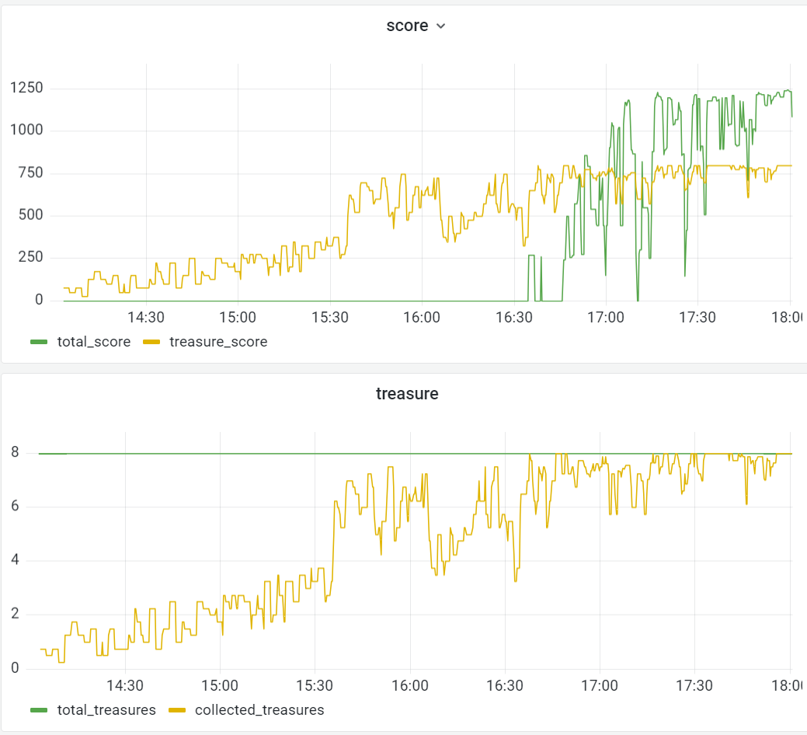 | 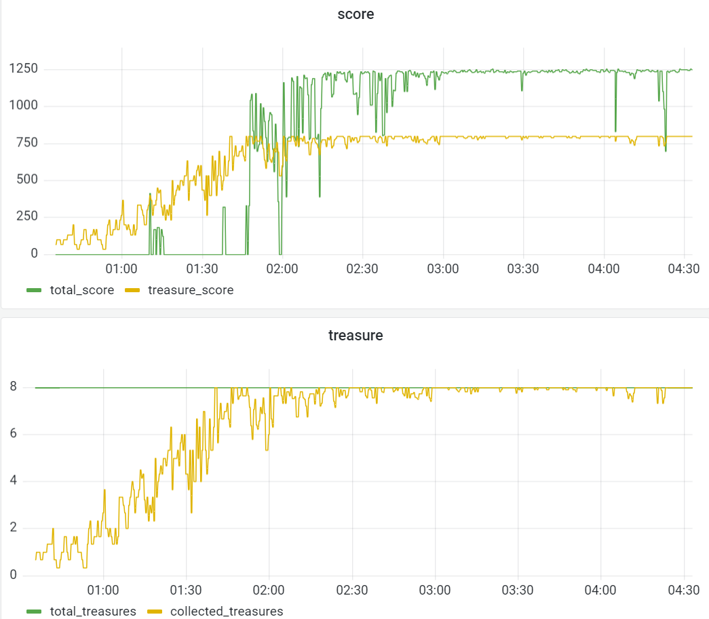 |
| Double DQN | Dueling DQN(double with no gradient clip) |
| 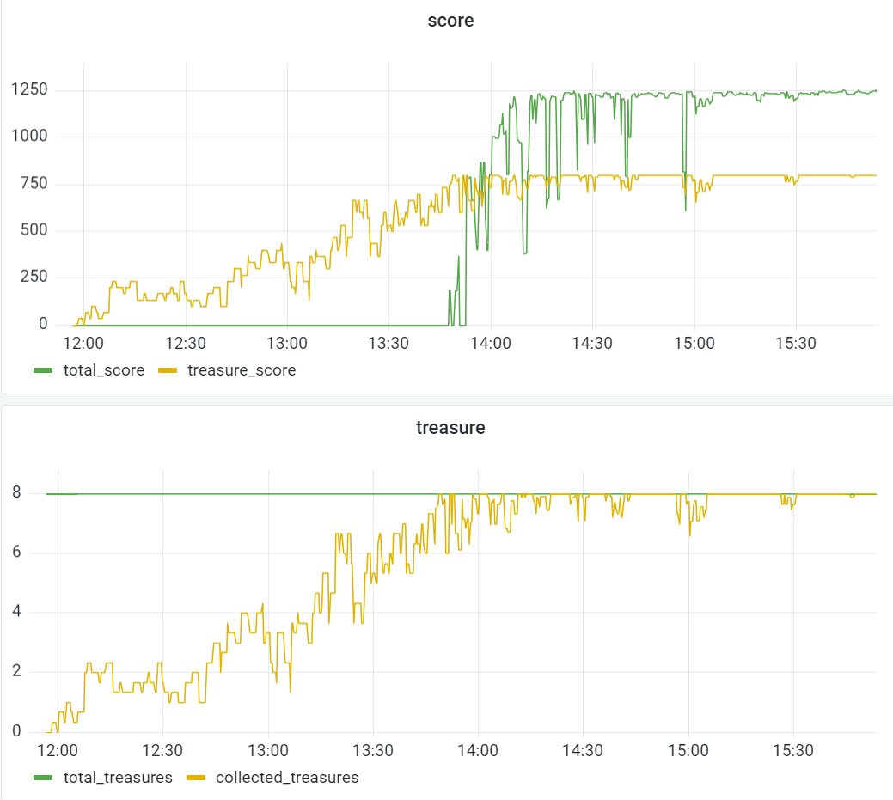 | 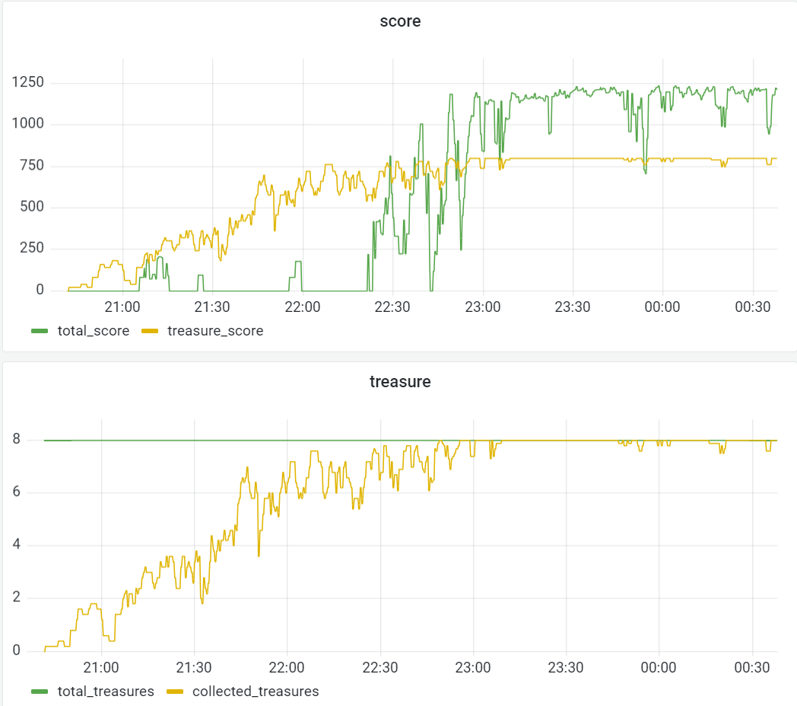 |

从图片中可以看出，三个改进算法的收敛速度都要明显快于 DQN，且收敛更加稳定。主要看Target DQN，非常有效的解决了DQN收敛慢以及不稳定的问题。Double DQN 收敛虽然晚于 Target DQN，但是收敛值更快更稳定，符合理论趋势。唯一不同的是 Dueling DQN 的收敛效果不太稳定，**针对于此，我额外进行了增加梯度裁剪的实验**，会在后续说明。

| Vanilla DQN Value |
| --- |
| 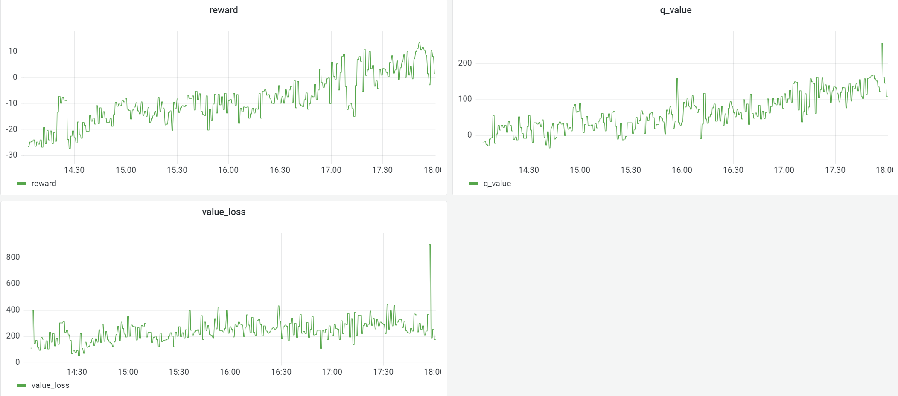 |
可以看到，reward 和 q_value 都在缓慢增长，且很不稳定。对于 value_loss，除了最后产生了极其不稳定的900以外，其他都在200-400之间，存在值过高估计问题。

| Targe DQN Value |
| --- |
| 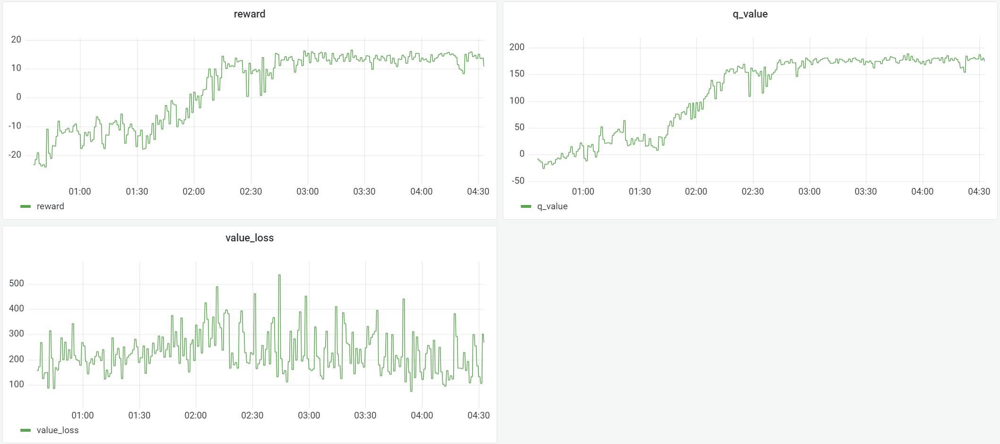 |
引入目标网络后，reward 和 q_value 增长并且能够收敛，但是之过高估计问题仍然存在，平均为300，且多次高于400。

| Double DQN Value |
| --- |
| 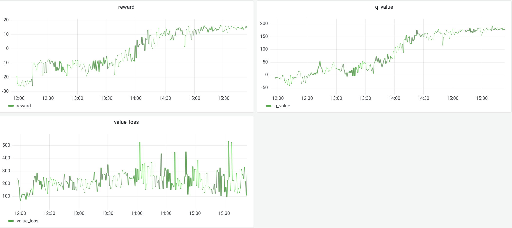 |
Double DQN 保留了 Target DQN 稳定的优点，reward 和 q_value 增长并且能够收敛，从图中可以看出对于值过高估计有一定效果，极端过高估计的值相比 Target DQN 变少，并且平均过高估计下降到200左右。通过调整训练参数应该有更好的效果。

| Dueling DQN (double with no gradient clip) Value |
| --- |
| 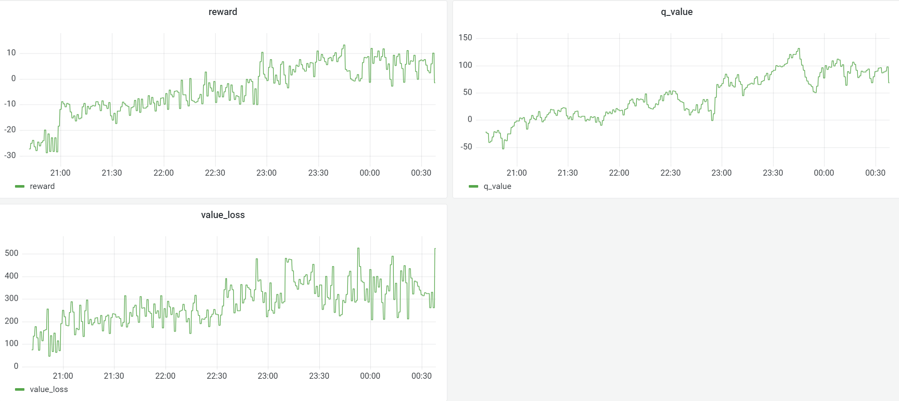 |
可以看到直接改变 Q 的建模方式，reward 和 value 前期就可以增长的很快，缺点是不够稳定。同时学习到的价值没有那么高，也可以看出来算法更注重价值的变化而不是价值的绝对大小。

| Dueling DQN (dqn with gradient clip) | Dueling DQN (target with gradient clip) |
| --- | --- |
| 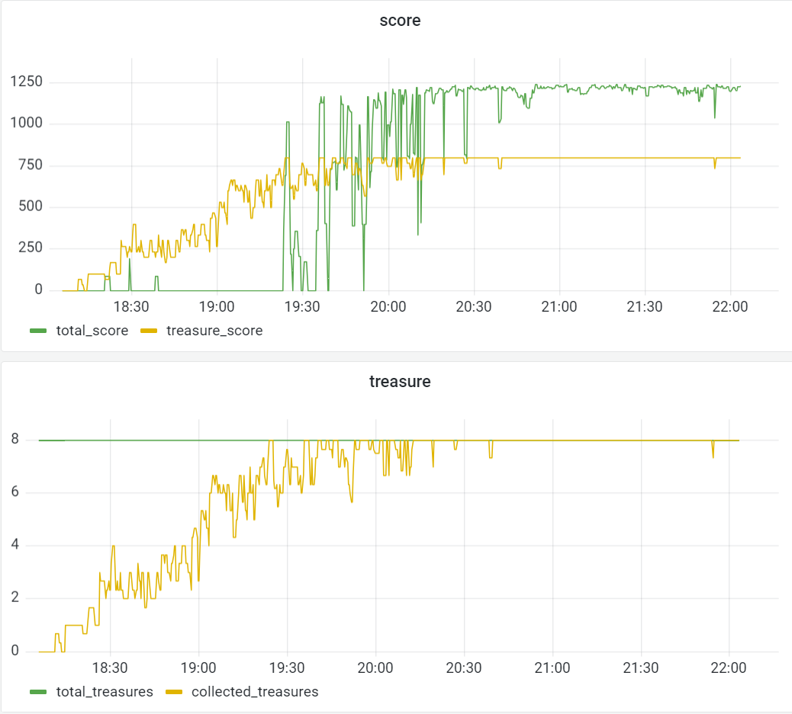 | 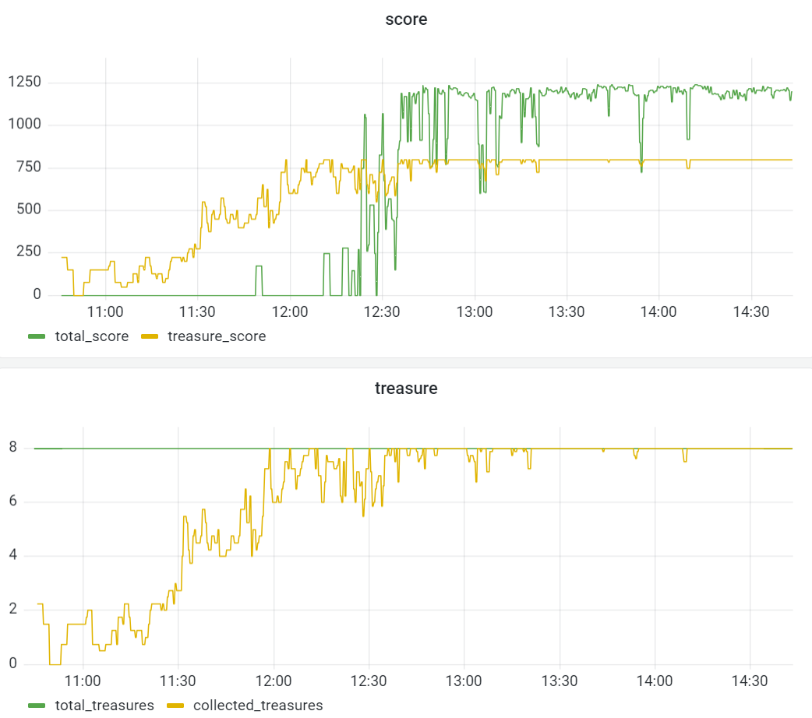 |

可以看到，增加 Dueling + Gradient Clip 的 DQN 效果提升显著（与前面的DQN相比较），收敛速度明显变快，收敛时间变早，收敛结果稳定。

| Dueling DQN (dqn with gradient clip) Value |
| --- | 
|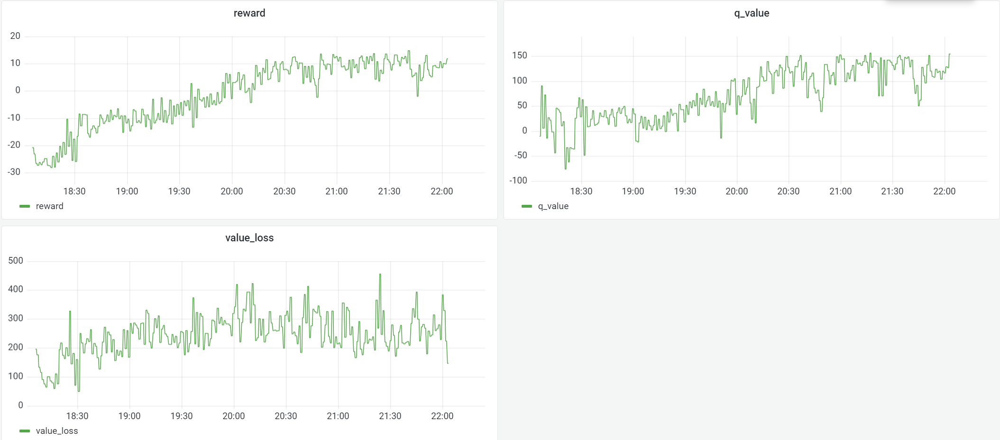 | 
| Dueling DQN (target with gradient clip) Value |
|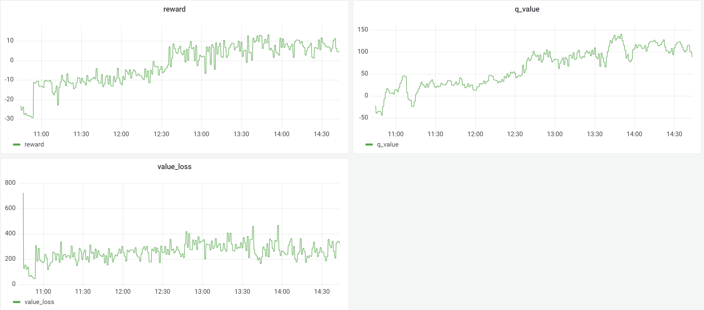 | 

观察两种增加了 clip 的 Dueling 算法，很明显的看到 dueling 能够使 reward 和 q_value 学习的很快，证明了该算法确实可以更有效的学习到最优动作。学习到的价值没有那么高是因为算法更注重价值的变化而不是价值的绝对大小。

### Evaluation and Analysis

评测时环境配置为随机8个宝箱，最大步数2000步，评测5轮。所有的算法模型在统一的评测配置下，5个任务都可以完成，最终达到的平均分数都在1200以上，单次最高可达到1260以上。每次任务平均使用一次超级闪现和一次加速。示例如下：

| demo1 | demo2 |
| --- | --- |
| 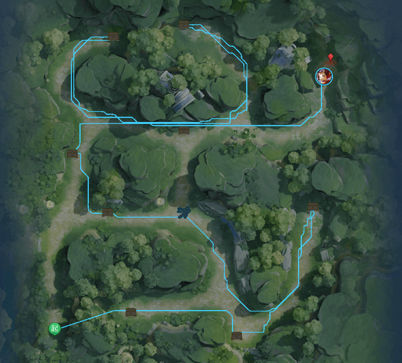 | 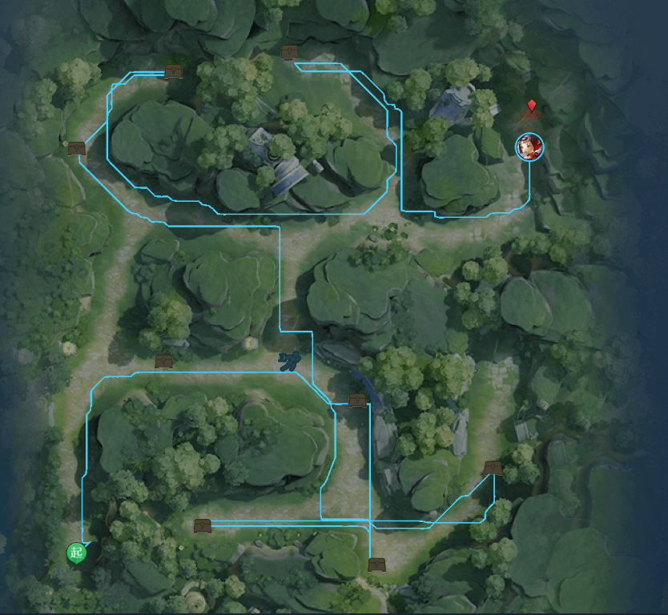 |

虽然都可以正确找到所有宝箱，并且基本在600步以内完成任务，但是可以看到仍然存在更好的路径。这可能是因为视野有限，而宝箱位置随机出现的缘故，在实际探索中，智能体会根据学习到的经验决定探索的顺序和动作。比如在开始的时候使用超级闪现是比较保险和高效的选择。

另外模型训练也会存在过拟合的情况，训练很稳定分数很高的模型可能在实际使用时的效果并不好。此时可以选择收敛时刻早一些的模型可能会有更好的效果。

