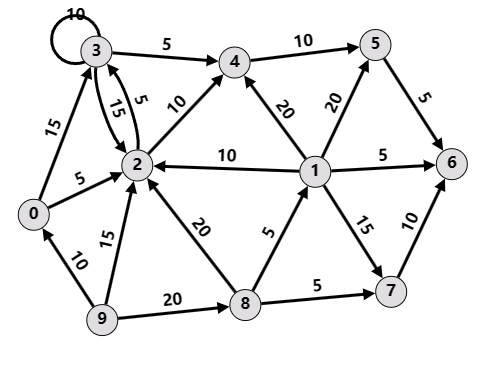

# Programming Assignment 3 Project 2 - Louvain

> TA Contact: Borui Yang, Hangyu Ye  
> E-mail: ybirua@sjtu.edu.cn, hangyu_ye@outlook.com

## 1. Introduction

In this assignment, we will implement the Louvain algorithm for community detection.

### 1.1. Environment

Python >= 3.6 is required for this project. By default, this project does not require additional Python packages, but please feel free to include other packages as needed. However, **DO NOT use existing community detection methods**, including but not limited to those from `networkx`.

### 1.2. Datasets

You are given a **directed citation network** (`./data/p2_edges.csv`) with 31,136 nodes and 220,325 edges, where the direction of the directed edge represents the citation relationship between papers. The papers come from 5 conferences (AAAI, IJCAI, CVPR, ICCV and ICML) and are labeled from 0 to 4 respectively. Your task is to **implement the Louvain algorithm to divide the papers into 5 communities**.

The project contains the following data files.

1. `./data/p2_edges.csv`. This is the directed paper citation graph. It contains 2 columns, where the first column indicates the source node id and the second column indicates the destination node id. **Node ids start from 0**.
2. `./data/label_reference.csv`. This csv file contains 300 ground truths as a reference. You can use this file to merge extra communities and test your algorithm (see the Tasks section below).
3. `./data/test_graph.csv`. This is a small weighted directed graph with 10 nodes. This graph is used for testing your implementation of modularity calculation (see the Tasks section below).

In this project, you do not have to worry about loading or processing the graphs. We have provided the driver code for loading the data, running the algorithm and processing the results. We have also prepared a data structure `WeightedDiGraph` in `graph.py` for handling the graphs.

## 2. Tasks

### 2.1. Computing Modularity (40%)

> Related Files: `community.py`, `louvain.py`, `test_modularity.py`.

The Louvain algorithm requires computing modularity gains of adding/removing nodes into/out of communities.

ℹ️ The graph in this assignment is a **weighted directed graph**. **For directed graphs, you should use the formulas below**

$$ Q_d(i \to C) = \frac{k_{i,in}}{m} - \frac{\left( k_i^{in}\cdot\Sigma_{tot}^{out} + k_i^{out}\cdot\Sigma_{tot}^{in} \right)}{m^2} $$

$$ Q_d(D \to i) = -Q_d(i \to D) = -\frac{k_{i,in}}{m} + \frac{\left( k_i^{in}\cdot\Sigma_{tot}^{out} + k_i^{out}\cdot\Sigma_{tot}^{in} \right)}{m^2} $$

where

- $k_{i,in}$ is the sum of weights of links between node $i$ and nodes in community $C$, including *both in-edges and out-edges*,
- $m$ is the sum of weights of all edges in the graph,
- $k_i^{in}, k_i^{out}$ is the in-weights and out-weights of node $i$ respectively,
- $\Sigma_{tot}^{in}, \Sigma_{tot}^{out}$ are the sum of all in-weights and out-weights of nodes in community $C$.

Follow the steps below and complete the calculation of modularity gain

1. **Implement the functions `add_node()` and `remove_node()` in the `Community` class (in `community.py`).** These two functions should update $\Sigma_{tot}^{in}$ and $\Sigma_{tot}^{out}$ whenever a node is added or removed from the community.
2. **Implement the functions `node2comm_in_degree()` and `node2comm_out_degree()` in the `Community` class (in `community.py`).** These two functions together would be used to compute $k_{i,in}$.
3. **Implement the `delta_modularity()` function in the `Louvain` class (in `louvain.py`).** This function should compute $\Delta Q_d(i \to C)$. Note that $\Delta Q_d(D \to i)$ can be computed similarly by $\Delta Q_d(D \to i) = -\Delta Q_d(i \to D)$.
4. **Add more test cases to `test_modularity.py` to verify the correctness of your modularity computation**. We have provided some BASIC unit tests in `test_modularity.py` as templates and examples. You should add more test cases to verify your modularity implementation.

Refer to the comments in the source code for more instructions and hints.

#### Testing Your Modularity Implementation

We use Python's built-in unit test framework (`unittest`) to verify the correctness of your modularity computation.

The unit test uses a simple weighted directed graph (defined in `data/test_graph.csv`). The graph is illustrated in the figure below.



The unit tests can be executed by

```plaintext
>>>> python .\test_modularity.py
..........
----------------------------------------------------------------------
Ran 10 tests in 0.001s

OK
```

If the functions (and your unit tests) are correctly implemented, you should be able to pass all tests and see an output similar to the one above.

warning: Please note that the provided test cases **IS FAR FROM ENOUGH** to verify the correctness of your implementation. **It is strongly recommended that you should add more test cases in `test_modularity.py`**.

Writing unit tests is optional. However, should you find your Louvain algorithm failing to converge, please first consider checking whether you have correctly implemented your modularity calculation. Your test cases do not count toward your final score (but the correctness of your algorithm does!).

### 2.2. Implementing Louvain Algorithm (60%)

> Related files: `louvain.py`, `main.py`.

Based on modularity, we can move on to implement the main part of the Louvain algorithm.

1. **Complete the missing parts marked with `TODO`s in `phase1()` and `phase2()` of the `Louvain` class (in `louvain.py`).** These two function corresponds to the two phases in the Louvain algorithm. Please refer to the comments in the TODO section for detailed instructions.
2. **Complete the `merge_communities()` method of the `Louvain` class.** In this assignment we expect 5 communities at the end. However, the Louvain algorithm typically terminates with more than 5 communities. Hence, you need to **find a way to merge extra communities**.
   - We have provided 300 ground truth labels in `label_reference.csv`. You could use these 300 labels to your advantage when merging the communities.
   - You could also explore other ways of merging extra communities. Refer to the comments in the source code for more information.

#### Running Your Louvain Algorithm

We have provided `main.py` as the driver code of your Louvain algorithm. It will automatically read the graph, run your implementation, and write the results.

```sh
python main.py
```

The provided code will automatically produce a `p2_prediction.csv` under `data/`. The CSV file contains 2 columns, where the first column corresponds to node ids and the second column indicates the corresponding community id.

## 3. Submission

Submit your results and all source code as a ZIP file, named as `[StudentID]_[ChineseName]_HW4.zip` (e.g., `522030910000_张三_HW4.zip`). The following files are REQUIRED in your submission.

```txt
张三_522030910000_HW4/
├── data/
│   └── p2_prediction.csv  # prediction produced by `main.py`
├── community.py           # your community implementation
├── graph.py
├── louvain.py             # your louvain algorithm
├── main.py                # main driver code
└── *.py                   # other necessary python files (if any)
```

The TAs will run you code by

```sh
# NOTE: we will use an unreleased version of `test_modularity.py` with additional test cases
python test_modularity.py  # For grading Task 1
python main.py             # For grading Task 2
```

Please DO NOT upload the datasets.

## 4. Requirements and Notes

### 4.1. Requirements

1. DO NOT use any existing community detection APIs.
2. DO NOT modify files or functions marked with `XXX: DO NOT MODIFY`. Other than these functions, please feel free to make other modifications if necessary.
3. DO NOT copy others' code, whether from your classmates or previous years' solutions. Plagiarism will result in *zero* scores for *all* involved parties.
4. Please ensure that your submission is runnable and reproducible. We will run your code and verify the results. A penalty will be imposed if there is a significant gap between your reported results and our reproduced ones.
5. You are encouraged (but not required) to follow good programming habits. E.g., use meaningful variable names, avoid extremely long lines, etc.

### 4.2. Other Notes

1. **We have provided a few data structures to facilitate your development (e.g., `WeightedDiGraph`, `Community`, etc.).** Read their documentation and use them to your advantage. You can also make modifications to these data structures, or create your own ones if you find the provided interfaces unable to meet your needs (though not recommended, since the workload could be high).
2. **You do not need to worry about the ordering of labels.** Our grading script will automatically resolve the *best possible* accuracy.

## 5. Grading

Each part will be graded independently.

#### 4.1. Computing Modularity (40%)

We have prepared additional test cases (not released) to test your modularity computation. The score will be given according to the results of our test cases. Full 40% if your code passes all our test cases, and deducted proportionally if some cases fail.

- Your own test cases will NOT be used for grading, and they do NOT count toward your final score.
- We would like to re-iterate that the provided test cases are insufficient to cover your implementation. Add your own test cases to ensure your modularity calculation is correct.

#### 4.2. Implementing Louvain Method (60%)

We will re-produce your submission and check your `p2_prediction.csv` against ground truth labels. We will set a 15-minute time limitation on your Louvain algorithm, and grade your implementation based on accuracy, according to the following metrics

|                           Metrics                           | Score (for this part) |
| :---------------------------------------------------------: | :-------------------: |
| Code runs without error. 5 communities. Accuracy above 70%. |         100%          |
| Code runs without error. 5 communities. Accuracy above 60%. |      90% - 100%       |
| Code runs without error. 5 communities. Accuracy above 50%. |       80% - 90%       |
| Code runs without error. 5 communities. Accuracy above 20%. |       60% - 80%       |
|         Code runs without error. 5-20 communities.          |          60%          |
|                        Other cases.                         |   Manually scored.    |

For your information,

- If you have implemented the core Louvain method correctly (without merging extra communities), it should be able to detect around 15 communities.
- The TA's implementation has achieved a final accuracy of 73% (on the full test set).

## References

1. V. D. Blondel, J.-L. Guillaume, R. Lambiotte, and E. Lefebvre, *Fast unfolding of communities in large networks*, Journal of statistical mechanics: theory and experiment, vol. 2008, no. 10, p. P10008, 2008.
2. N. Dugué and A. Perez, *Directed Louvain: maximizing modularity in directed networks*, Université d’Orléans, 2015.
3. [Networkx Documentation: `networkx.communities.modularity()`](https://networkx.org/documentation/stable/reference/algorithms/generated/networkx.algorithms.community.quality.modularity.html).
4. [Networkx Documentation: `networkx.communities.louvain_communities()`](https://networkx.org/documentation/stable/reference/algorithms/generated/networkx.algorithms.community.louvain.louvain_communities.html).

**Note.** The documentation of `networkx` APIs also contain useful information and insights on the Louvain algorithm, which you can use as a source of reference. However, you are NOT ALLOWED to directly call the two APIs above in your main Louvain implementation.
